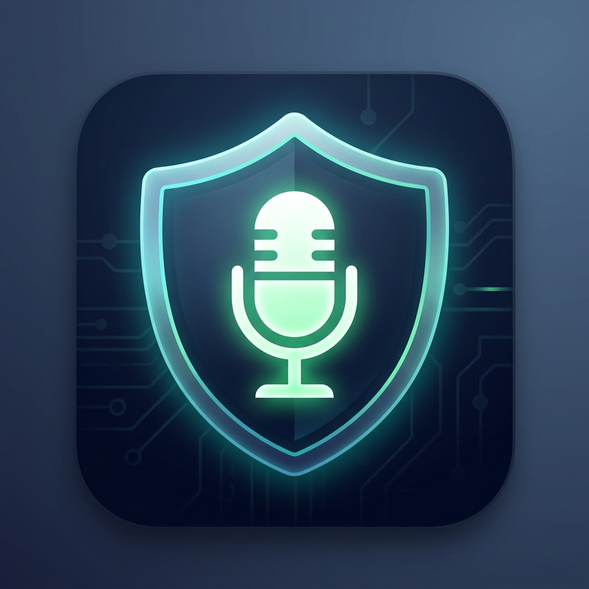

# MuteGuard — Public Release Repository

  
  <h1>MuteGuard v4.0</h1>
  
A free, lightweight Windows 10/11 audio utility for instant mic & speaker mute control.

  
  
  
  

---

## 🌐 Website

**[→ Visit the MuteGuard website](https://xionraj.github.io/MuteGuard/)**

---

## What is MuteGuard?

MuteGuard is a lightweight Windows 11 audio control utility that puts your microphone and speaker mute toggles right at your fingertips — no more diving into system settings mid-call.

## ✨ Core Features

- **Dual Audio Control** — Independently mute mic and speaker with one click
- **Keyboard Shortcuts** — `Win + Alt + M` for mic, `Win + Alt + S` for speaker (fully rebindable)
- **Dual System Tray Icons** — Real-time mute state shown in the taskbar at all times
- **Floating Mini Window** — Always-on-top widget, draggable, scalable, position saved
- **Smart Device Detection** — Auto-scans all connected audio devices; easy dropdown switching
- **Dark Mode & Light Mode** — Matches Windows 11 native aesthetics
- **Run at Startup** — Launch with Windows automatically
- **Custom Icons** — Pick from any `.dll` or `.ico` file using native Windows picker
- **Persistent Settings** — All preferences saved to a local `.ini` file
- **Graceful Error Handling** — Retries 3× before surfacing tray notification

## ⚙️ System Requirements

| Requirement | Details |
|-------------|---------|
| OS | Windows 10 / Windows 11 (64-bit) |
| Size | < 2 MB |
| Installation | **Portable** (run anywhere, no setup) **or** **Installer** (full Windows integration) |

## 🐛 Report a Bug

Found an issue? Please open it on the [main repository](https://github.com/xionraj/MuteGuard/issues).

## 📥 Download

Download the latest release from the [Releases page](https://github.com/xionraj/MuteGuard/releases/latest).

## ♥ Support

MuteGuard is free, forever. If you find it useful, please consider [sponsoring the project](https://github.com/sponsors/xionraj) — it helps fund continued development.

## 📄 License

[MIT License](LICENSE) © xionraj
